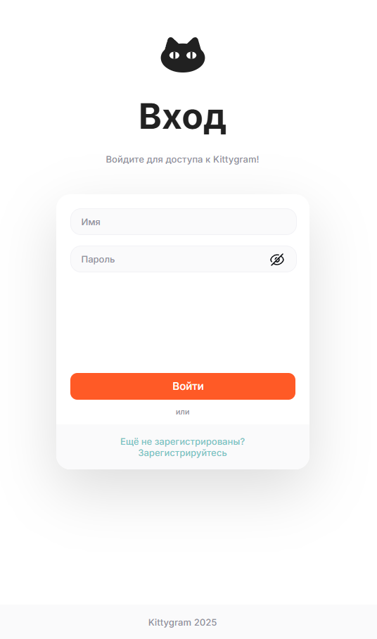
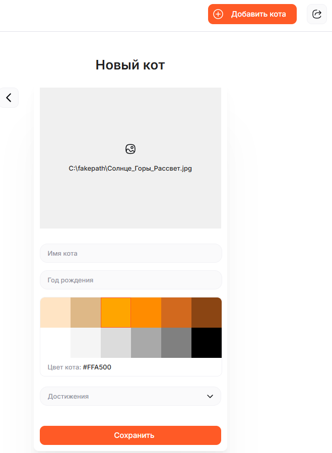
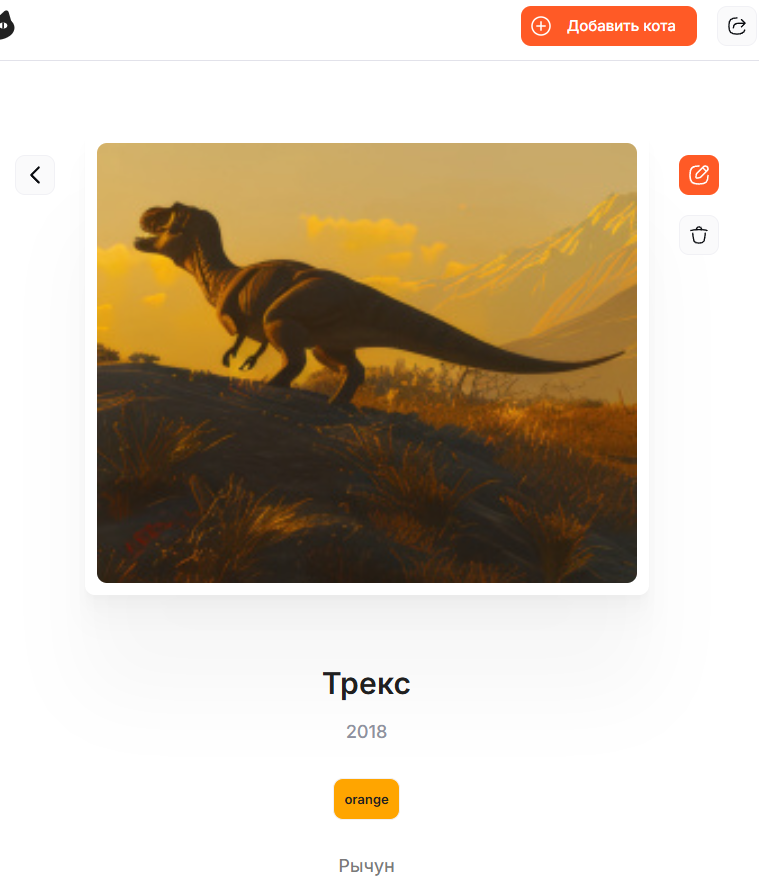

# 🐱 Kittygram

**Социальная сеть для любителей котиков** с полнофункциональным CI/CD пайплайном и автоматическим деплоем.


## 📖 О проекте

Kittygram — это full-stack веб-приложение для обмена фотографиями и информацией о котиках. Пользователи могут создавать профили своих питомцев, добавлять достижения и делиться ими с сообществом.

### 🎯 Решаемые задачи
- **Централизованная платформа** для любителей кошек
- **Автоматизация деплоя** с помощью CI/CD
- **Пример production-ready** приложения с микросервисной архитектурой
- **Демонстрация best practices** в DevOps и full-stack разработке
``` python
## 🏗️ Архитектура
Kittygram/
├── 🐍 backend/ (Django REST API)
├── ⚛️ frontend/ (React SPA)
├── 🚀 nginx/ (Reverse proxy & static files)
├── 📦 docker-compose.yml (Development)
├── 🏭 docker-compose.production.yml (Production)
└── ⚙️ .github/workflows/ (CI/CD pipeline)
```

## 🛠️ Технологический стек

### Backend
- **Python 3.9** + **Django 3.2.3**
- **Django REST Framework** для API
- **PostgreSQL** / SQLite
- **Djoser** для аутентификации
- **Pillow** для работы с изображениями

### Frontend
- **React 18** + **Node.js**
- **Modern JavaScript** (ES6+)

### Infrastructure
- **Docker** + **Docker Compose**
- **Nginx** как reverse proxy
- **GitHub Actions** для CI/CD
- **Docker Hub** для хранения образов

## 🚀 Быстрый старт

### Автоматический деплой (рекомендуется)

Проект настроен с полным CI/CD пайплайном:

``` python
# 1. Клонировать репозиторий
git clone https://github.com/Kosmonaffter/kittygram_final.git
cd kittygram_final

# 2. Запушить изменения в main ветку
git add .
git commit -m "Deploy Kittygram"
git push origin main
```
После пуша автоматически выполняются:

✅ Запуск тестов backend и frontend

✅ Сборка Docker образов

✅ Публикация образов на Docker Hub

✅ Деплой на продакшен сервер

✅ Миграции и сбор статики

✅ Уведомление в Telegram о статусе
``` python
Ручной запуск (для разработки)
bash
# Запуск всех сервисов
docker-compose up -d --build

# Выполнение миграций
docker-compose exec backend python manage.py migrate

# Сбор статики
docker-compose exec backend python manage.py collectstatic --noinput

# Создание суперпользователя
docker-compose exec backend python manage.py createsuperuser
```

Приложение будет доступно по адресу: http://localhost:9000

📁 Структура проекта
Backend (Django)
``` python
backend/
├── cats/                    # Основное приложение
│   ├── models.py           # Модели Cat, Achievement
│   ├── serializers.py      # Сериализаторы с кастомными полями
│   ├── views.py            # ViewSets для API
│   └── tests.py            # Модульные тесты
├── kittygram_backend/      # Настройки проекта
│   ├── settings.py         # Конфигурация с поддержкой PostgreSQL/SQLite
│   └── urls.py             # Маршруты API
├── requirements.txt        # Зависимости Python
└── Dockerfile             # Образ для backend
Frontend (React)
text
frontend/
├── build/                  # Собранные статические файлы
└── Dockerfile             # Образ для frontend
Infrastructure
text
nginx/
├── nginx.conf             # Конфигурация Nginx
└── Dockerfile             # Образ для gateway

docker-compose.yml         # Development окружение
docker-compose.production.yml # Production окружение
.github/workflows/main.yml # CI/CD пайплайн
```

🔧 API Endpoints
Аутентификация
POST /api/users/ - Регистрация

POST /api/token/login/ - Получение токена

POST /api/token/logout/ - Выход

Кошки
GET /api/cats/ - Список котиков

POST /api/cats/ - Создание котика

GET /api/cats/{id}/ - Детали котика

PUT /api/cats/{id}/ - Обновление

DELETE /api/cats/{id}/ - Удаление

Достижения
GET /api/achievements/ - Список достижений

🎯 Ключевые особенности

🔄 Кастомные сериализаторы
python
class Base64ImageField(serializers.ImageField):
    # Поддержка base64 изображений
    def to_internal_value(self, data):
        if isinstance(data, str) and data.startswith('data:image'):
            format, imgstr = data.split(';base64,')
            ext = format.split('/')[-1]
            data = ContentFile(base64.b64decode(imgstr), name='temp.' + ext)
        return super().to_internal_value(data)

🎨 Поддержка цветов
python
class Hex2NameColor(serializers.Field):
    # Конвертация HEX цветов в названия
    def to_internal_value(self, data):
        try:
            data = webcolors.hex_to_name(data)
        except ValueError:
            raise serializers.ValidationError('Для этого цвета нет имени')
        return data

🐳 Полная Docker-зация
Мульти-стадийные сборки

Оптимизированные production образы

*Изолированные сервисы*

⚙️ CI/CD Pipeline
Этапы пайплайна:
Tests - Запуск backend и frontend тестов

Build & Push - Сборка и публикация Docker образов

Deploy - Автоматический деплой на сервер

Notify - Уведомление в Telegram

Требуемые секреты:
yaml
DOCKER_USERNAME:          # Имя пользователя Docker Hub
DOCKER_PASSWORD:          # Пароль Docker Hub
SSH_HOST:                 # IP/hostname сервера
SSH_USERNAME:             # Пользователь SSH
SSH_PRIVATE_KEY:          # Приватный ключ SSH
TELEGRAM_CHAT_ID:         # ID чата Telegram
TELEGRAM_TOKEN:           # Токен бота Telegram
POSTGRES_USER:            # Пользователь БД
POSTGRES_PASSWORD:        # Пароль БД
POSTGRES_DB:              # Имя БД
🚀 Production деплой
Требования к серверу:
Docker и Docker Compose

SSH доступ по ключу

Открытый порт 9000

Процесс деплоя:
Образы автоматически пулятся с Docker Hub

Контейнеры перезапускаются с новыми версиями

Выполняются миграции БД

Собирается статика

Приложение готово к работе

🧪 Тестирование
``` python
Backend тесты
bash
cd backend
python manage.py test
Frontend тесты
bash
cd frontend
npm test -- --watchAll=false
Code quality
bash
flake8 backend/
```
🔒 Безопасность
Token Authentication через Djoser

Environment variables для конфиденциальных данных

PostgreSQL в production

Nginx как reverse proxy

CORS настройки

📈 Мониторинг и логи
Docker logs для отслеживания ошибок

GitHub Actions для мониторинга пайплайна

Telegram уведомления о статусе деплоя

🐛 Известные проблемы
Размер изображений
Большие изображения могут замедлять загрузку

Рекомендуется оптимизация перед загрузкой

Миграции БД
Автоматические миграции выполняются при каждом деплое

Рекомендуется бэкап БД перед обновлениями

🤝 Разработка
``` python
Локальная разработка
bash
# Backend отдельно
cd backend
# Примените миграции
python manage.py migrate
# Создайте суперпользователя (опционально)
python manage.py createsuperuser

# Запустите сервер
python manage.py runserver

# Frontend отдельно  
cd frontend
npm start
```

Добавление новых фич

Создать feature ветку

Реализовать функциональность

Написать тесты

Создать Pull Request

После мержа в main - автоматический деплой

📞 Поддержка
Автор: Юрий Атласюк
Telegram: @kosmonafftsb
Email: kosmonaffter@yandex.ru
Год: 2025